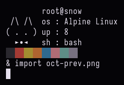

# october
...is a retro-scented colorscheme with the main focus being readability.
it's designed for basic, everyday terminal use.
the configs are provided for the following terminals:
- alacritty
- stterm (read the config beforehand)
- konsole
- xfce4-terminal
- xterm/urxvt
## showcase

more screenshots would be much appreciated, open an issue if you're willing to provide one
have fun!
